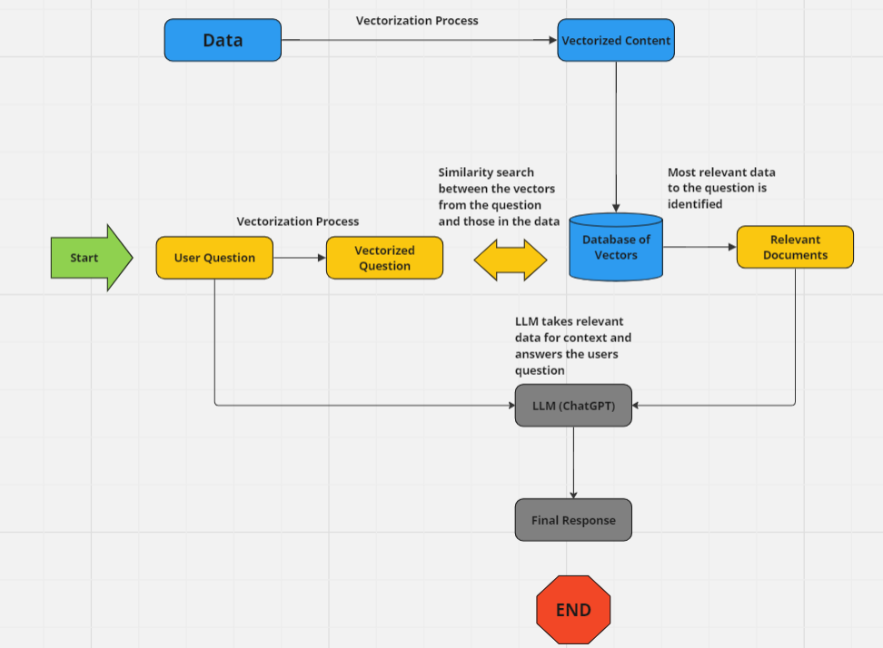
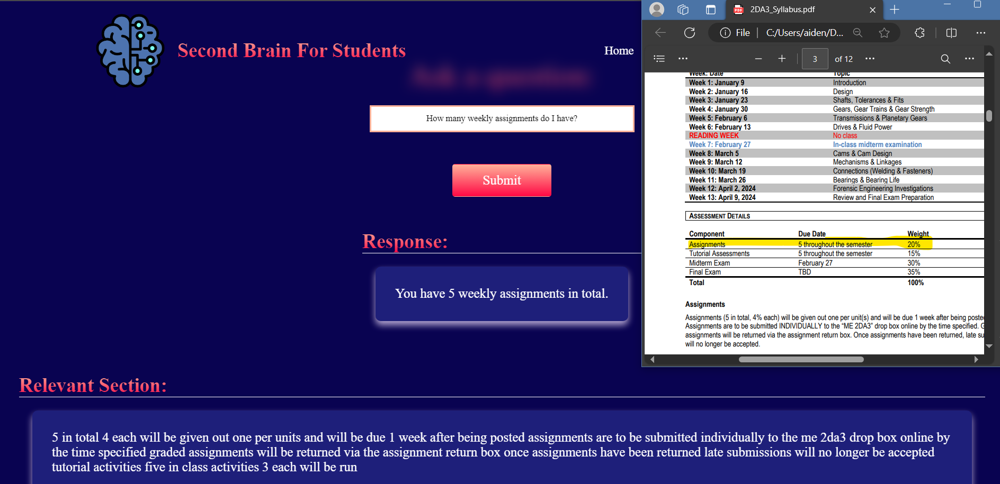

# SecondBrain
Our project  team of 7 created a website called SecondBrain that allows users to upload documents to their unique database and ask questions about the documents at any time without the need of ever uploading the document more than once.

## Technologies
We utilized technologies such as GPT-4, vectorization, vector databases, LangChain, and Similarity Search through API integration.

## Process 
Step 1: The user uploads a document in Pdf or Docx format. 
Step 2: We use LangChain to turn the document data into plain text and remove all special characters. 
Step 3: We cut up the text into chunk sizes of 500 (about one paragraph) and vectorize the data using GPT embeddings. 
Step 4: The vectorized paragraphs are uploaded to the unique user's vector database (Pinecone database). 
Step 5: When the user asks a question we vectorize the question and perform a similarity search with the question and database to return the most similar paragraph. 
Step 6: The un-vectorized question and paragraph are sent to GPT-4 to ensure a clear answer. 
Step 7: The user receives the relevant section (the paragraph) along with the clear answer from GPT-4.<be>

